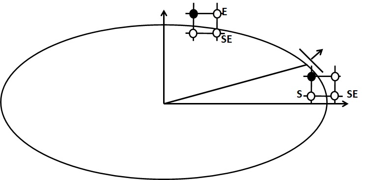

Ellipse draw algorithm
======================

The problem is to determine which pixels need to be colored to rasterize an axes aligned ellipse, given its centre and semi-major and semi-minor axes lengths.

The main idea is that when a curve passes between two pixels, the pixel that is closer is chosen. This is decided by the relative position of the curve with respect to the midpoint between the two pixels.

By virtue of symmetry, we can iterate through only a quarter of the ellipse to efficiently rasterize it completely.

Midway through the iteration, since the curve of the ellipse starts to move faster vertically than horizontally, the pixels to consider coloring change. Thus the ellipse is rasterized in two steps, unlike the other figures.

The `bresenham::figure::add_ellipse() <../code-reference/figure.html#_CPPv4N9bresenham6figure11add_ellipseE4uint4uint4uint4uint>`__ method implements the same.