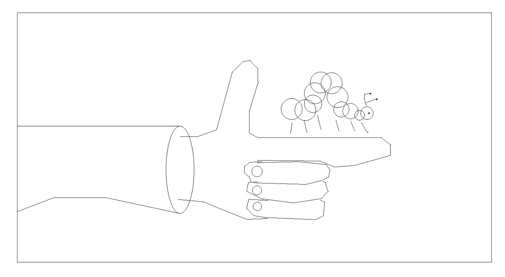

Metamorphosis
=============

We all have our cocoons to break out of. We all see the light at the end of our tunnels, thirsting for its warmth. Such is the way of life, of metamorphosis...

Storyboard
----------

.. video:: ../_images/storyboard.mp4
   :width: 500
   :height: 300

|

Summary
-------

Metamorphosis is a story of one boy's journey of friendship with a friend from an unlikely place. When the boy's father enters his dingy room with a caterpillar, the boy is initially indifferent towards the curious critter. The caterpillar's repeated tresspasses over his computer only annoys him, cursing the caterpillar for intruding in his shut-in lifestyle. However, he realises that the caterpillar was merely after the leaves in his untouched bowl of food, and his anger turns to compassion as he feeds the hungry critter. Leaf by leaf, the boy grows closer to the caterpillar, till one day it forms a cocoon and hatches into a butterfly. The boy is now forced to let it go, and opens his window, flooding his room and life with light, as he watches the butterfly flutter into the sky. He then closes his computer and leaves his room, having evolved in his own way.

Here are some frames rendered using the `Bresenham algorithm <algorithms.html>`__.

.. image:: ../images/frame3.jpeg
  :alt: Frame 3
  :align: left
  :width: 80%
